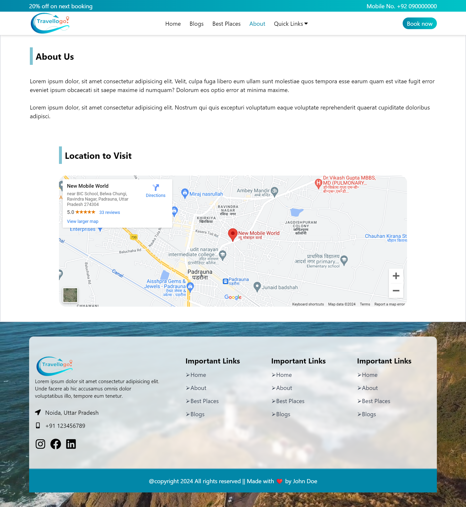
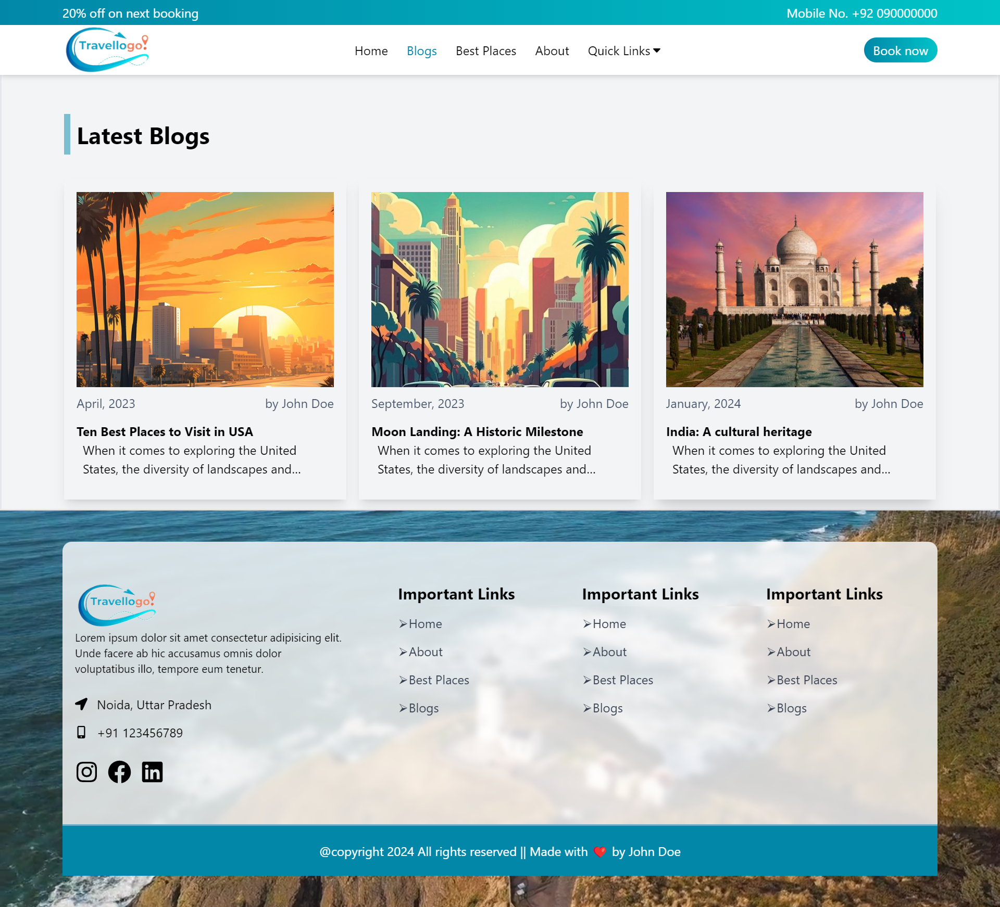
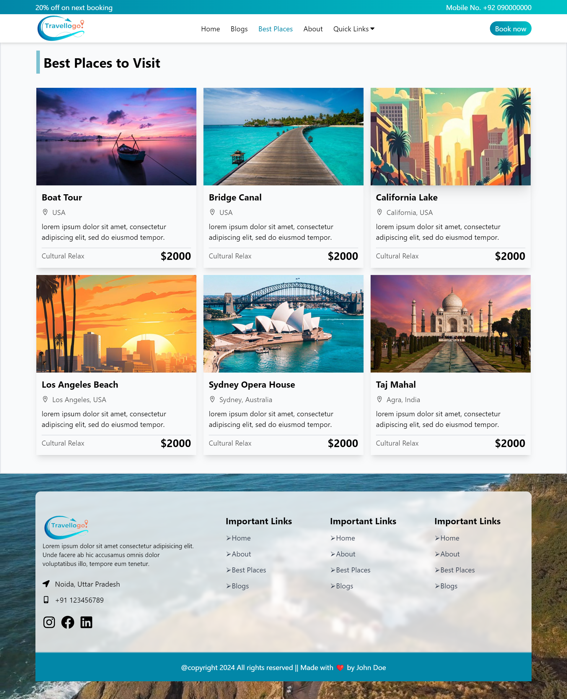

## Travel Website Description

### Overview
Our travel website is a modern, responsive, and user-friendly platform built entirely with React.js. It leverages the power of React Router DOM for seamless navigation, Context API for state management, and Google Maps integration for an enhanced user experience. The visual design is crafted with Tailwind CSS to ensure a clean, sleek, and highly customizable interface.

### Key Features
1. Home Page:
    - Hero Section: A visually appealing hero section that captures the essence of travel with stunning imagery and a welcoming message.
    - Blog Section: Featuring the best places to visit around the world, offering travel tips and inspiring stories to ignite your wanderlust.
    - Best Tourist Spots: Highlighting top tourist attractions globally, providing brief overviews and enticing visuals to help you plan your next adventure.
    - Footer: Comprehensive footer with quick links to other sections of the website, social media handles, and contact information.
      
  

2. About Page:
    - Detailed information about the website’s mission, vision, and the team behind it. This section aims to build trust and connect with our audience on a personal level.
      

3. Blog Page:
    - A dedicated page for all blog posts, categorized and searchable for easy access. Each post features high-quality content with engaging visuals, travel tips, and personal anecdotes.
      

4. Best Places Page:
    - A curated list of the best travel destinations around the world. Each place is showcased with beautiful images, descriptions, and integrated Google Maps for precise location details.
      

### Technologies Used
React.js: For building a dynamic and responsive user interface.
React Router DOM: For managing navigation and creating a single-page application experience.
Context API: For efficient state management across the application.
Google Maps Integration: To provide interactive maps and location-based services.
Tailwind CSS: For designing a modern, flexible, and aesthetically pleasing UI.

### Conclusion
This travel website is designed to be the ultimate travel companion, offering inspiration, information, and interactive features to help users plan their dream vacations. Whether you’re looking for the best tourist spots or in-depth blogs about travel experiences, our website has it all.

## Screenshots

